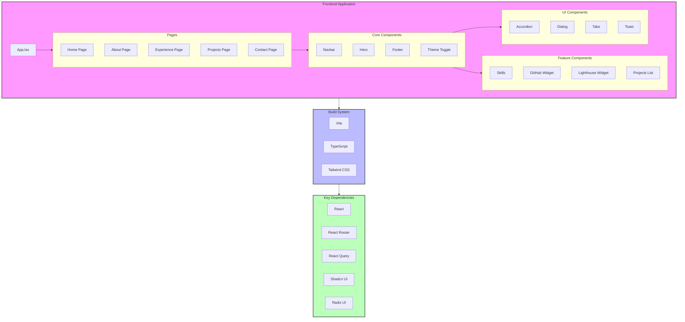
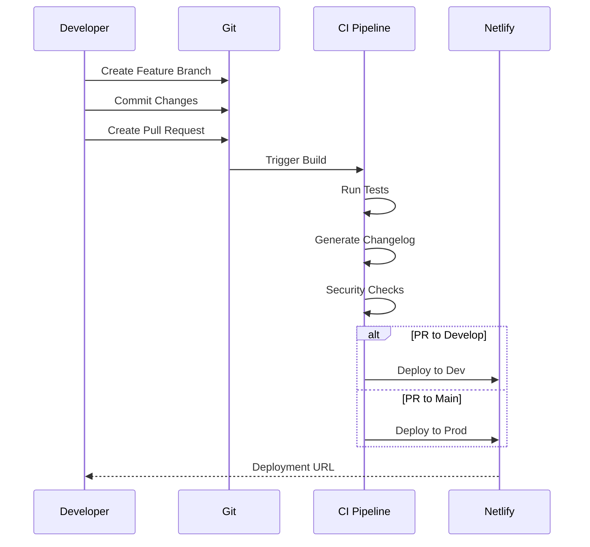

# Lead Ops Showcase Hub Architecture

## Application Architecture



## CI/CD Pipeline

```mermaid
graph LR
    subgraph CI["Continuous Integration"]
        Commit[Git Commit]
        PR[Pull Request]
        Main[Main Branch]
        
        subgraph Build["Build Process"]
            NpmInstall[NPM Install]
            Build[Vite Build]
            Test[Tests]
            Lint[ESLint]
        end
        
        subgraph Quality["Quality Checks"]
            Lighthouse[Lighthouse]
            SBOM[CycloneDX SBOM]
            Snyk[Snyk Security]
        end
    end
    
    subgraph CD["Continuous Deployment"]
        Netlify[Netlify]
        subgraph Environments["Environments"]
            Dev[Development]
            Prod[Production]
        end
    end
    
    %% Connections
    Commit --> PR
    PR --> Build
    Main --> Build
    
    Build --> Quality
    Quality --> Netlify
    Netlify --> Environments
    
    %% Styling
    classDef ci fill:#f96,stroke:#333,stroke-width:2px
    classDef cd fill:#69f,stroke:#333,stroke-width:2px
    classDef build fill:#9f6,stroke:#333,stroke-width:2px
    
    class CI ci
    class CD cd
    class Build build
```

## Development Workflow



## Key Features

1. **Frontend Architecture**
   - React-based SPA with TypeScript
   - Component-based architecture using Shadcn UI
   - Responsive design with Tailwind CSS
   - Dark/Light theme support

2. **Build System**
   - Vite for fast development and building
   - TypeScript for type safety
   - ESLint and Prettier for code quality
   - Husky for git hooks

3. **CI/CD Pipeline**
   - Automated testing and building
   - Security scanning with Snyk
   - SBOM generation with CycloneDX
   - Automated changelog generation
   - Netlify deployment for both dev and prod

4. **Quality Assurance**
   - Lighthouse performance monitoring
   - Automated security scanning
   - Code quality checks
   - Conventional commits with czg 